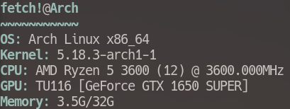
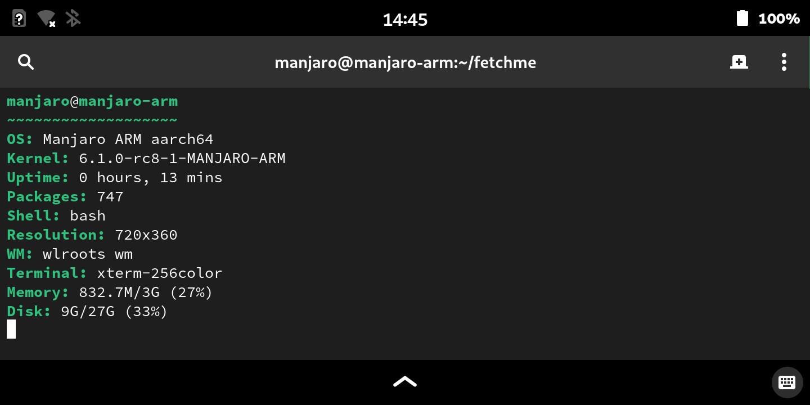

## fetchme
Rewrite of fetchme-bash in C99. Similiar to neofetch, but in C, so it should be able to do more.

download with:

``git clone https://github.com/Connor-GH/fetchme``

``cd fetchme``

compile with:

# [gcc]

``make CC=gcc -j$(nproc)``, or on BSD, ``gmake CC=gcc -j``

# [clang]

``make CC=clang -j$(nproc)``, or on BSD, ``gmake CC=clang LINKER=clang -j``

or to install it to /usr/bin:

``make CC=gcc-or-clang -j$(nproc) && sudo make install``

reinstall:
``make CC=gcc-or-clang -j$(nproc) && sudo make uninstall && sudo make install``

# debugging (or for development):

``make CC=gcc-or-clang DEBUG=true -j$(nproc) fetchme`` (requires clang/gcc)

# PGO (Profile Guided Optimization) building
- requires clang
``make CC=clang pgo && make CC=clang pgo``

(It has to be run twice due to how PGO works. The testing is automated in the Makefile.)

read the changelog
<a href="docs/CHANGELOG.md">here</a>

# Configuration
- configuration is done in the provided config.mk. the instructions are given in the file.

# Mandatory Dependencies:
- clang or gcc
- gmake

# Optional Dependencies
[access to ``make format``]
- clang-format

[Debugging]
- valgrind, gdb, etc

[Resolution detection]
- libx11 (or libxcb)

[Refresh Rate detection]
- libxrandr (or libxcb)

[GPU detection]
- libpci
